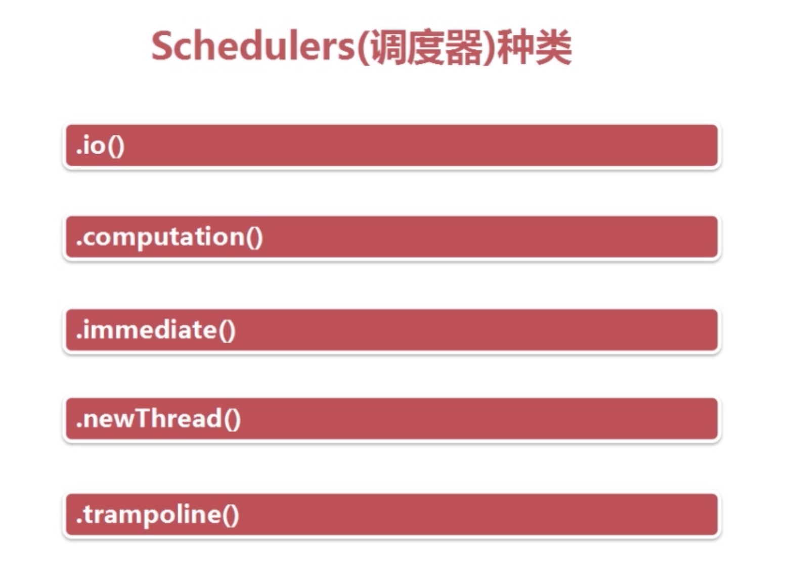

# RxJava

## 观察者模式四要素

* Observable 被观察者

*  Observer 观察者

*  subscribe 订阅

*  事件

## 操作符

### 创建被观察者(Creating Observable)

[创建操作符，用来创建被观察者](/doc/创建操作符.md)

### 转换被观察者(Transform Observable)

[转换操作符，用来转换被观察者](/doc/转换操作符.md)

### 过滤操作符(Filtering Observable)

[过滤操作符，用来过滤](/doc/过滤操作符.md)

### 组合操作符(Combining Observable)

[组合操作符，用来组合](/doc/组合操作符.md)

### 错误处理操作符(Error Handling Operators)

[错误处理操作符，用来处理错误与异常](/doc/错误处理操作符.md)

## 调度器

调度器是RxJava以一种极其简单的方式解决多线程问题机制

| 调度器操作符 | 作用 |
| ----- | :-------: |
| Schedulers.io() | 用于I/O操作，主要用于各种耗时操作 |
| Schedulers.computation() | 计算工作的默认调度器，与I/O操作无关。例如：buffer(),debounce(),delay(),interval(),sample(),skip() |
| Schedulers.immediate() | 允许你立即在当前线程执行你指定的工作。例如：timeout(),timeInteval(),timestamp() |
| Schedulers.newThread()  | 指定任务启动一个新的线程 |

