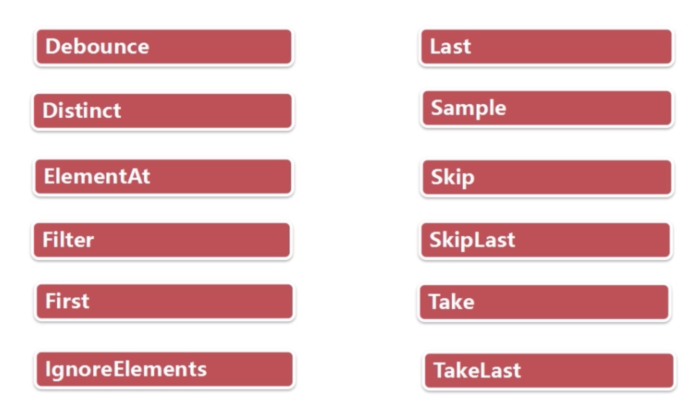

# 过滤操作符




## debounce操作符

```
    /**
     * debounce操作符
     * only emit an item from an Observable if a particular timespan has passed without it emitting another item
     * 只有在超过特定时间段后而没有发出另一个项目的情况下，才会从Observable发出一个项目
     */
    private void debounce() {
        Observable.create(new Observable.OnSubscribe<Integer>() {
            @Override
            public void call(Subscriber<? super Integer> subscriber) {
                try {
                    for (int i=0;i<10;i++){
                        Thread.sleep(1000);
                        subscriber.onNext(i);
                    }
                    subscriber.onCompleted();
                }catch (Exception e){
                    subscriber.onError(e);
                }
            }
        }).debounce(1, TimeUnit.SECONDS)
                .subscribe(new Subscriber<Integer>() {
                    @Override
                    public void onCompleted() {
                        Log.d(TAG, "onCompleted: ");
                    }

                    @Override
                    public void onError(Throwable e) {
                        Log.d(TAG, "onError: ");
                    }

                    @Override
                    public void onNext(Integer integer) {
                        Log.d(TAG, "onNext: "+integer);
                    }
                });
    }
```


## distinct操作符

```
    /**
     * distinct操作符
     * suppress duplicate items emitted by an Observable
     * 抑制Observable发出的重复项目
     * 去重
     */
    private void distinct() {
        Observable.just(1,2,3,1,4,4,5)
                .distinct()
                .subscribe(new Subscriber<Integer>() {
                    @Override
                    public void onCompleted() {
                        Log.d(TAG, "onCompleted: ");
                    }

                    @Override
                    public void onError(Throwable e) {
                        Log.d(TAG, "onError: "+e.getMessage());
                    }

                    @Override
                    public void onNext(Integer integer) {
                        Log.d(TAG, "onNext: "+integer);
                    }
                });
    }
```

## elementAt操作符

```
    /**
     * elementAt操作符
     * emit only item n emitted by an Observable
     * 只发射由Observable发出的项目n
     * 用来挑选指定位置数据
     */
    private void elementAt() {
        Observable.just(1,2,3,4,5,6)
                .elementAt(0)
                .subscribe(new Subscriber<Integer>() {
                    @Override
                    public void onCompleted() {
                        Log.d(TAG, "onCompleted: ");
                    }

                    @Override
                    public void onError(Throwable e) {
                        Log.d(TAG, "onError: ");
                    }

                    @Override
                    public void onNext(Integer integer) {
                        Log.d(TAG, "onNext: "+integer);
                    }
                });
    }
```


## filter操作符

```
    /**
     * filter操作符
     *  emit only those items from an Observable that pass a predicate test
     *  仅从通过特定测试的Observable中发出那些项
     *  根据特定条件筛选数据项
     */
    private void filter() {
        Observable.just(1,2,3,4,4,3,2,6,7)
                .distinct()
                .filter(new Func1<Integer, Boolean>() {
                    @Override
                    public Boolean call(Integer integer) {
                        return integer%2==0?true:false; //判断是否为偶数
                    }
                })
                .subscribe(new Subscriber<Integer>() {
                    @Override
                    public void onCompleted() {
                        Log.d(TAG, "onCompleted: ");
                    }

                    @Override
                    public void onError(Throwable e) {
                        Log.d(TAG, "onError: ");
                    }

                    @Override
                    public void onNext(Integer integer) {
                        Log.d(TAG, "onNext: "+integer);
                    }
                });
    }
```

## first操作符

```
    /**
     * first操作符
     * emit only the first item, or the first item that meets a condition, from an Observable
     * 从Observable中只发出第一个项目或符合条件的第一个项目
     */
    private void first() {
        Observable.just(1,2,3)
                .first()
                .subscribe(new Subscriber<Integer>() {
                    @Override
                    public void onCompleted() {
                        Log.d(TAG, "onCompleted: ");
                    }

                    @Override
                    public void onError(Throwable e) {
                        Log.d(TAG, "onError: ");
                    }

                    @Override
                    public void onNext(Integer integer) {
                        Log.d(TAG, "onNext: "+integer);
                    }
                });
    }
```


## ignoreElements操作符

```
    /**
     * ignoreElements操作符
     * do not emit any items from an Observable but mirror its termination notification
     * 不要从Observable发出任何项目，但镜像其终止通知
     */
    private void ignoreElements() {
        Observable.create(new Observable.OnSubscribe<Integer>() {
            @Override
            public void call(Subscriber<? super Integer> subscriber) {
                subscriber.onNext(124);
                throw new NullPointerException();
            }
        })
                .ignoreElements()
                .subscribe(new Subscriber<Integer>() {
                    @Override
                    public void onCompleted() {
                        Log.d(TAG, "onCompleted: ");
                    }

                    @Override
                    public void onError(Throwable e) {
                        Log.d(TAG, "onError: ");
                    }

                    @Override
                    public void onNext(Integer integer) {
                        Log.d(TAG, "onNext: "+integer);
                    }
                });
    }
```

## last操作符

```
    /**
     * last操作符
     * emit only the last item emitted by an Observable
     * 只发出一个最后一个项目
     */
    private void last() {
        Observable.just(1,2,3,4,5)
                .last()
                .subscribe(new Subscriber<Integer>() {
                    @Override
                    public void onCompleted() {
                        Log.d(TAG, "onCompleted: ");
                    }

                    @Override
                    public void onError(Throwable e) {
                        Log.d(TAG, "onError: ");
                    }

                    @Override
                    public void onNext(Integer integer) {
                        Log.d(TAG, "onNext: "+integer);
                    }
                });
    }
```

## sample操作符

```
    /**
     * sample操作符
     * emit the most recent item emitted by an Observable within periodic time intervals
     * 在周期性时间间隔内发出由Observable发出的最近的项目
     */
    private void sample() {
        Observable.create(new Observable.OnSubscribe<Integer>() {
            @Override
            public void call(Subscriber<? super Integer> subscriber) {
                try {
                  for (int i=0;i<10;i++){
                      Thread.sleep(1000);
                      subscriber.onNext(i);
                  }
                  subscriber.onCompleted();
                }catch (Exception e){
                    subscriber.onError(e);
                }
            }
        }).sample(4,TimeUnit.SECONDS)
                .subscribe(new Subscriber<Integer>() {
                    @Override
                    public void onCompleted() {
                        Log.d(TAG, "onCompleted: ");
                    }

                    @Override
                    public void onError(Throwable e) {
                        Log.d(TAG, "onError: ");
                    }

                    @Override
                    public void onNext(Integer integer) {
                        Log.d(TAG, "onNext: "+integer);
                    }
                });
    }
```

## skip操作符

```
    /**
     * skip操作符
     * suppress the first n items emitted by an Observable
     * 跳过Observable发出的前n个项目
     */
    private void skip() {
        Observable.just(1,2,3,4,5,6,7,8)
                .skip(2)
                .subscribe(new Subscriber<Integer>() {
                    @Override
                    public void onCompleted() {
                        Log.d(TAG, "onCompleted: ");
                    }

                    @Override
                    public void onError(Throwable e) {
                        Log.d(TAG, "onError: ");
                    }

                    @Override
                    public void onNext(Integer integer) {
                        Log.d(TAG, "onNext: "+integer);
                    }
                });
    }
```

## skipLast操作符

```
    /**
     * skipLast操作符
     * suppress the last n items emitted by an Observable
     * 跳过Observable发出的后n个项目
     */
    private void skipLast() {
        Observable.just(1,2,3,4,5,6,7,8)
                .skipLast(2)
                .subscribe(new Subscriber<Integer>() {
                    @Override
                    public void onCompleted() {
                        Log.d(TAG, "onCompleted: ");
                    }

                    @Override
                    public void onError(Throwable e) {
                        Log.d(TAG, "onError: ");
                    }

                    @Override
                    public void onNext(Integer integer) {
                        Log.d(TAG, "onNext: "+integer);
                    }
                });
    }
```

## take操作符

```
    /**
     * take操作符
     * emit only the first n items emitted by an Observable
     * 只发出一个Observable发出的前n个项目
     * 只取前n个数据
     */
    private void take() {
        Observable.just(1,2,3,4,5,6,7,8)
                .take(4)
                .subscribe(new Subscriber<Integer>() {
                    @Override
                    public void onCompleted() {
                        Log.d(TAG, "onCompleted: ");
                    }

                    @Override
                    public void onError(Throwable e) {
                        Log.d(TAG, "onError: ");
                    }

                    @Override
                    public void onNext(Integer integer) {
                        Log.d(TAG, "onNext: "+integer);
                    }
                });
    }
```


## takeLast操作符

```
    /**
     * takeLast操作符
     *  emit only the last n items emitted by an Observable
     *  只发出一个Observable发出的后n个项目
     *  只取后n个数据
     */
    private void takeLast() {
        Observable.just(1,2,3,4,5,6,6,7,8)
                .takeLast(3)
                .subscribe(new Subscriber<Integer>() {
                    @Override
                    public void onCompleted() {
                        Log.d(TAG, "onCompleted: ");
                    }

                    @Override
                    public void onError(Throwable e) {
                        Log.d(TAG, "onError: ");
                    }

                    @Override
                    public void onNext(Integer integer) {
                        Log.d(TAG, "onNext: "+integer);
                    }
                });
    }

```
